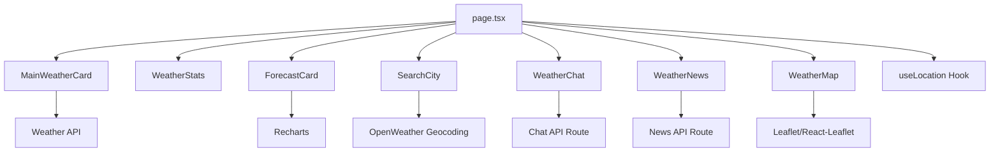

# Components Overview

SkyCast IA is built with a modular component architecture using Next.js 16, React 19, and Tailwind CSS. The application features a sophisticated weather visualization system with AI-powered insights.

## Component Architecture

The application follows a component-based architecture with clear separation of concerns:

```
src/components/ui/
├── MainWeatherCard.tsx      # Main weather display with AI analysis
├── ForecastCard.tsx         # Hourly forecast with chart visualization
├── WeatherStats.tsx         # Weather metrics grid
├── SearchCity.tsx           # City search with autocomplete
├── WeatherChat.tsx          # AI chat interface
├── WeatherNews.tsx          # Weather-related news articles
├── WeatherMap.tsx           # Interactive Leaflet map
└── WeatherAlerts.tsx        # Weather alerts component
```

## Core UI Components

### MainWeatherCard

The primary weather display component featuring:
- Large temperature display with dynamic weather icons
- Location and local time information
- AI-powered weather analysis with real-time insights
- Adaptive theming based on weather conditions
- Dynamic animations for different weather states

**Key Features:**
- Temperature-based color schemes (snow, hot, neutral)
- Animated weather icons (Sun, Moon, Cloud, Rain, Snow, Lightning)
- Real-time AI weather analysis integration

### ForecastCard

Hourly forecast visualization with:
- 8-hour forecast display with hourly breakdown
- Animated area chart using Recharts library
- Precipitation probability indicators
- Intelligent rain/snow status messaging
- Responsive horizontal scrolling on mobile

### WeatherStats

Metrics dashboard displaying:
- Feels-like temperature
- Humidity percentage
- Wind speed (km/h)
- Atmospheric pressure (hPa)

Each stat features icon-based visualization using Lucide React icons.

### SearchCity

Advanced search component with:
- Real-time autocomplete using OpenWeather Geocoding API
- Search history stored in localStorage
- Mobile-optimized bottom sheet modal
- Desktop dropdown interface
- Debounced API requests (400ms delay)

### WeatherChat

AI-powered chat interface featuring:
- Google reCAPTCHA v2 verification
- Context-aware responses based on current weather
- Suggested quick-action prompts
- Message history management
- Adaptive theming

### WeatherNews

News aggregation component displaying:
- Weather-related news articles
- Image-rich card layout
- External link integration
- Responsive grid layout (1-3 columns)

### WeatherMap

Interactive map powered by Leaflet:
- Multiple weather layer overlays (temperature, precipitation, wind)
- Custom map markers with animations
- Click-to-interact UX pattern
- Custom zoom controls
- Dynamic tile layer based on weather conditions

## Component Dependency Tree



## Styling Approach

SkyCast IA uses **Tailwind CSS v4** for all styling with:

### Design System

- **Spacing:** Generous padding and rounded corners (2rem - 3rem border radius)
- **Typography:** Bold, uppercase tracking for headers; monospace for time display
- **Colors:** Dynamic based on weather conditions
- **Effects:** Backdrop blur, glass morphism, and smooth transitions

### Adaptive Theming

Components automatically adjust styling based on weather conditions:

<CodeGroup>
```tsx Snow Theme
const isSnow = weatherType === "snow";
const bgClass = isSnow ? "bg-black/5" : "bg-white/10";
const textClass = isSnow ? "text-slate-900" : "text-white";
```

```tsx Hot Theme
const isHot = temp > 28;
const glowColor = isHot ? "bg-orange-500/20" : "bg-white/10";
```
</CodeGroup>

### Custom Animations

CSS-in-JS animations for enhanced interactivity:

- `animate-spin-slow` - 12s rotating sun icon
- `animate-float` - Floating moon/cloud animations
- `animate-bounce-slow` - Rain/snow icon bounce
- `animate-pulse` - Loading states

## Shared Utilities

### API Integration

All components consume data from centralized API utilities:

```typescript
// src/lib/api/weather.ts
getCurrentWeather(lat, lon)      // Current conditions
getWeatherForecast(lat, lon)     // 5-day forecast
getWeatherByCity(city)           // Search by city name

// src/lib/api/mistral.ts
getAiWeatherAnalysis(weather)    // AI insights

// src/lib/api/news.ts
getNews(city)                     // Related news
```

### Custom Hooks

```typescript
// src/hooks/useLocation.ts
const { coords, loading, refresh, error } = useLocation();
```

Provides geolocation with auto-refresh capability.

## State Management

Components use local React state with prop drilling for shared data. The main `page.tsx` orchestrates state:

```tsx
const [weather, setWeather] = useState<any>(null);
const [forecast, setForecast] = useState<any[]>([]);
const [aiAnalysis, setAiAnalysis] = useState("");
const [news, setNews] = useState<any[]>([]);
```

## Performance Optimizations

- **Dynamic imports:** WeatherMap loaded with `next/dynamic` to avoid SSR issues
- **Debounced search:** 400ms delay on autocomplete requests
- **Memoized calculations:** useMemo for map coordinates
- **Lazy loading:** News images loaded on-demand
- **Optimistic UI:** Immediate state updates with loading states

## Accessibility Features

- Semantic HTML structure
- ARIA labels on interactive elements
- Keyboard navigation support
- High contrast mode compatibility
- Screen reader-friendly content

## Browser Compatibility

- **Modern browsers:** Chrome, Firefox, Safari, Edge (latest 2 versions)
- **Geolocation API** required for auto-location
- **JavaScript:** ES2020+ features used
- **CSS Grid & Flexbox** for layouts

## Next Steps

Explore detailed documentation for each component:

<CardGroup cols={2}>
  <Card title="Weather Cards" icon="cloud-sun" href="/components/weather-cards">
    MainWeatherCard, ForecastCard, and WeatherStats components
  </Card>
  <Card title="Search" icon="magnifying-glass" href="/components/search">
    SearchCity component with autocomplete
  </Card>
  <Card title="Chat Interface" icon="comments" href="/components/chat-interface">
    AI-powered WeatherChat component
  </Card>
</CardGroup>