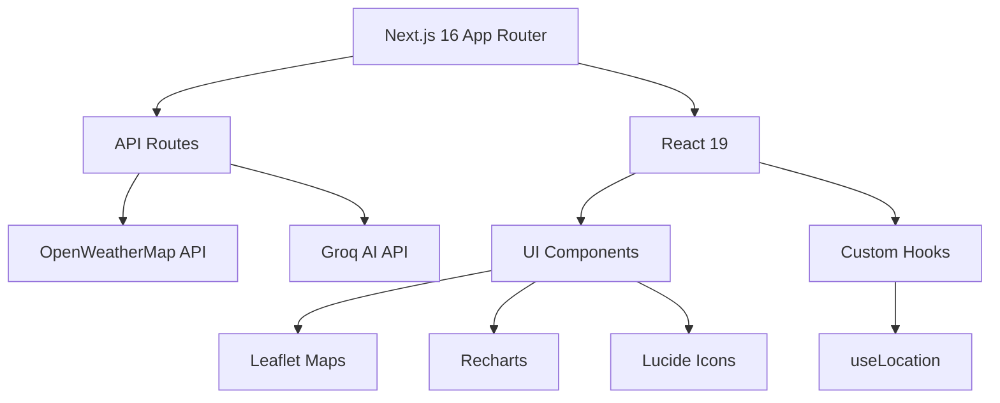

# Introduction to SkyCast IA

SkyCast IA is a modern, AI-enhanced weather application built with Next.js that delivers real-time weather data with intelligent analysis. Experience weather forecasting reimagined with cutting-edge technology and beautiful, responsive design.

## What is SkyCast IA?

SkyCast IA combines traditional meteorological data from OpenWeatherMap with AI-powered insights from Groq's LLM to provide not just weather information, but actionable recommendations and conversational weather assistance.

The application automatically detects your location and displays comprehensive weather data including current conditions, hourly forecasts, interactive maps, and personalized AI analysis.

## Key Features

<Note>
All features are powered by real-time data and designed for optimal user experience across desktop and mobile devices.
</Note>

### Real-Time Weather Data

- **Current Conditions**: Temperature, humidity, wind speed, atmospheric pressure, and weather descriptions
- **Hourly Forecast**: 24-hour forecast with detailed metrics for planning ahead
- **Location Detection**: Automatic GPS-based location with fallback to manual city search
- **Global Coverage**: Search and view weather for any city worldwide

### AI-Powered Intelligence

- **Weather Analysis**: Groq AI (Llama 3.1) analyzes current conditions and provides personalized recommendations
- **Interactive Chat**: Conversational interface to ask weather-related questions
- **Smart Recommendations**: AI suggests appropriate clothing and activities based on conditions

### Interactive Visualizations

- **Weather Map**: Leaflet-powered interactive map showing your location and weather patterns
- **Forecast Charts**: Visual representation of temperature and precipitation trends
- **Weather News**: Curated news feed related to weather in your selected location
- **Dynamic Themes**: UI adapts to weather conditions (snow, rain, clear, hot, etc.)

### Modern User Experience

- **Responsive Design**: Optimized for mobile, tablet, and desktop
- **City Search**: Advanced autocomplete search with OpenWeatherMap geocoding
- **Search History**: Quick access to recently viewed locations
- **Loading States**: Smooth animations and loading indicators
- **Accessibility**: ARIA labels and keyboard navigation support

## Architecture Overview

SkyCast IA is built with a modern tech stack optimized for performance and developer experience:



### Core Technologies

**Frontend Framework**
- **Next.js 16.1.6**: React framework with App Router for server-side rendering and API routes
- **React 19**: Latest React with improved performance and features
- **TypeScript 5**: Type-safe development with modern TS features

**Styling**
- **Tailwind CSS 4**: Utility-first CSS framework with custom configuration
- **Custom CSS**: Dynamic weather-based themes and animations

**Data & APIs**
- **OpenWeatherMap**: Current weather, forecasts, and geocoding
- **Groq AI**: LLM-powered weather analysis using Llama 3.1-8b-instant
- **News API**: Weather-related news aggregation

**UI Components & Libraries**
- **Leaflet**: Interactive maps with react-leaflet wrapper
- **Recharts**: Responsive charting library for forecast visualization
- **Lucide React**: Beautiful, consistent icon set
- **country-state-city**: Location data for city search

**Security**
- **Google reCAPTCHA v3**: Bot protection for AI chat feature

## Project Structure

The application follows Next.js App Router conventions:

```
src/
├── app/
│   ├── api/
│   │   ├── chat/route.ts      # AI chat endpoint
│   │   └── news/route.ts      # News aggregation
│   ├── layout.tsx             # Root layout
│   ├── page.tsx               # Main dashboard
│   └── globals.css            # Global styles
├── components/
│   └── ui/
│       ├── MainWeatherCard.tsx    # Primary weather display
│       ├── ForecastCard.tsx       # Hourly forecast
│       ├── WeatherStats.tsx       # Detailed metrics
│       ├── WeatherMap.tsx         # Interactive map
│       ├── WeatherChat.tsx        # AI chat interface
│       ├── WeatherNews.tsx        # News feed
│       └── SearchCity.tsx         # City search
├── hooks/
│   └── useLocation.ts         # Geolocation management
└── lib/
    └── api/
        ├── weather.ts         # OpenWeatherMap client
        └── mistral.ts         # Groq AI client
```

## Use Cases

<Steps>

### Daily Weather Checking

Users open the app to quickly check current conditions and decide what to wear. The AI provides instant recommendations based on temperature, humidity, and weather patterns.

### Travel Planning

Search for weather in destination cities to plan trips. View hourly forecasts to schedule outdoor activities during optimal weather windows.

### Weather Conversations

Ask the AI chatbot questions like "Should I bring an umbrella?" or "What should I wear today?" for personalized, context-aware responses.

### Location Monitoring

Track weather in multiple locations through search history. Perfect for users with family in different cities or managing remote teams.

</Steps>

## What's Next?

Ready to get started? Head over to the [Quickstart](/quickstart) guide to see weather data in under 5 minutes, or jump to the [Installation](/installation) page for detailed setup instructions.

<Warning>
SkyCast IA requires API keys for OpenWeatherMap and Groq AI. Make sure to obtain these before starting the installation process.
</Warning>